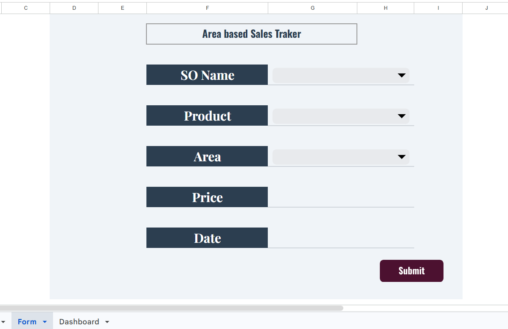
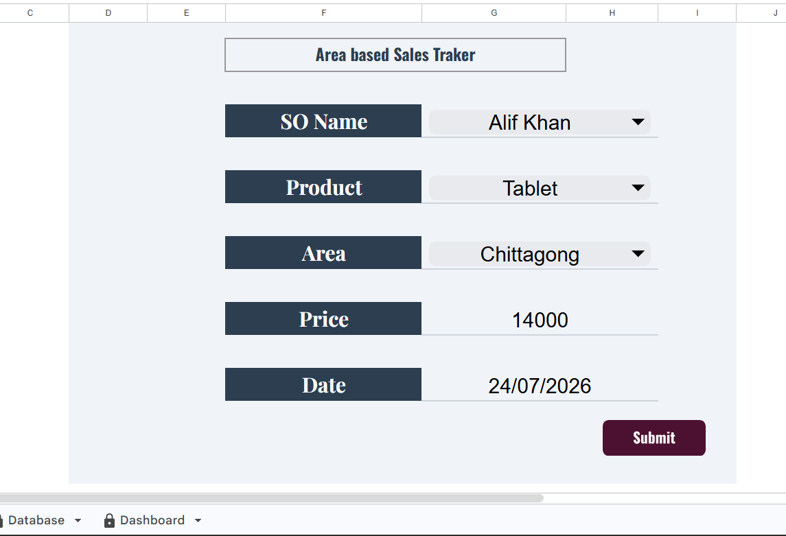
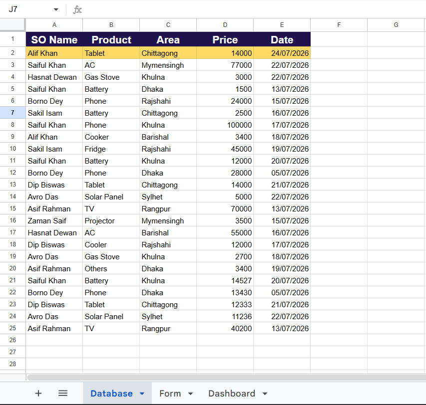
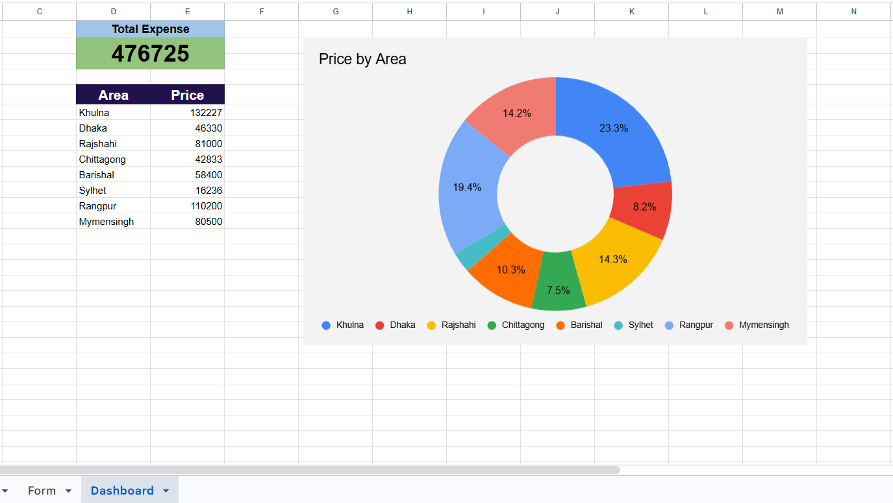

# Automation Sales Tracker

A focused sales-tracking automation project built in **Google Sheets** using a controlled entry form, data validation, custom macros, an automated database layer, and a live dashboard.

The project is designed to reduce repetitive manual work while improving data quality and giving management faster visibility into sales activity.

[View the Live Published Tracker](https://docs.google.com/spreadsheets/d/1TK7DMBhOknn1WobVjUFcyenDR0r7Q_iWPYRZpOH5Dc0/edit?gid=1955352547#gid=1955352547)

---

## What I Built

- Controlled sales-entry form
- Data validation for key input fields
- Automated transaction submission
- Master sales database
- Custom macro-based processing
- Automatic record placement
- Live dashboard updates
- Area-based sales monitoring

---

## System Workflow

```text
Sales Entry Form
       ↓
Data Validation
       ↓
Submit
       ↓
Custom Macro
       ↓
Master Database
       ↓
Dashboard Recalculation
       ↓
Updated Sales View
```

The project follows a three-tier structure:

**Form → Database → Dashboard**

The case study describes the form as the controlled input layer, the database as the automated storage layer, and the dashboard as the live visualization layer.

---

# 1. Data Entry & Validation

The entry form was designed to control how field transactions enter the system.

### Demonstrated

- Dedicated data-entry interface
- Validation dropdowns
- Sales Officer selection
- Product selection
- Target Region selection
- Controlled user input
- Reduced risk of inconsistent entries



---

# 2. Automated Transaction Processing

Instead of manually locating the next available row in the database, the user submits the transaction through the form.

### Example Transaction

- Sales Officer: Alif Khan
- Product: Tablet
- Region: Chittagong
- Sales Value: 14,000

The documented workflow shows the transaction being submitted through the form, after which the custom macro processes the entry.



---

# 3. Master Database

The master database acts as the automated storage layer.

### Demonstrated

- Historical transaction records
- Centralized sales data
- Database protected from direct field-user editing
- Automated insertion of new transactions
- Record placement handled by the macro



---

# 4. Macro Automation

The custom macro connects the entry form with the database and dashboard.

### Automation Flow

- User clicks Submit
- Macro fires
- New transaction is pushed into the master database
- New record is inserted at the top
- Dashboard values recalculate
- Updated metrics become visible

The documented example shows Chittagong moving from **28,833 / 5.2%** to **42,833 / 7.5%** after the 14,000 transaction is submitted.


---

# 5. Live Dashboard

The dashboard provides a management-facing view of the updated sales information.

### Demonstrated

- Area-based sales visibility
- Updated regional values
- Visual comparison
- Live recalculation after submission
- Management-oriented reporting



---

# 6. Operational Impact

The project documentation highlights three intended operational outcomes.

### Data Quality

- Field users interact with the form instead of the master database
- Downstream formulas remain protected

### Time Savings

- Reduces manual copying
- Reduces manual pasting
- Reduces manual sorting
- Reduces repetitive structural formatting

### Real-Time Visibility

- Metrics update after transaction submission
- Management can view refreshed figures without manually rebuilding the report

---

# Key Skills Demonstrated

| Area | Skills |
|---|---|
| Spreadsheet Automation | Custom macros, automated submission, automated record handling |
| Data Quality | Data validation, controlled input, structured entry |
| Data Management | Master database, centralized transaction records |
| Reporting | Live dashboard, area-based sales monitoring |
| Workflow Design | Form → Database → Dashboard |
| Operational Improvement | Reduced repetitive manual processing, faster visibility |

---

# Documentation

The repository includes the project case-study presentations used to document the automation workflow.

### Primary Case Study

[Area Based Sales Tracker - Automation Case Study](Documentation/Area%20Based%20Sales%20Tracker%20-%20Automation%20Case%20Study.pptx)


This presentation documents the same project from slightly different presentation structures. They are retained for reference, while the README provides the concise project overview.

---

# Author

**Dipan Nandi**

Statistics Graduate | Data Analytics

- LinkedIn: https://www.linkedin.com/in/dipannandi/
- Email: dipabu007@gmail.com