# Excel Skills Portfolio

A practical collection of Excel work focused on **data preparation, formula-driven analysis, data retrieval, business calculations, and structured reporting**.

The workbooks in this repository document skills practiced across different business and analytical scenarios rather than a single project.

---

## Portfolio Preview

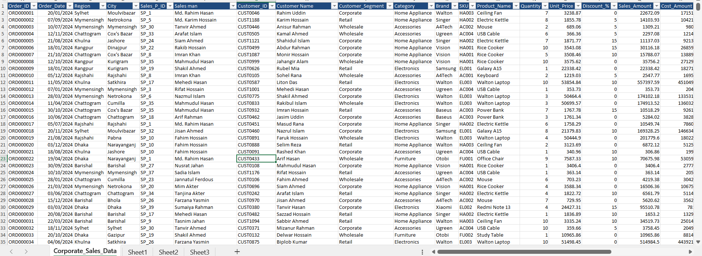
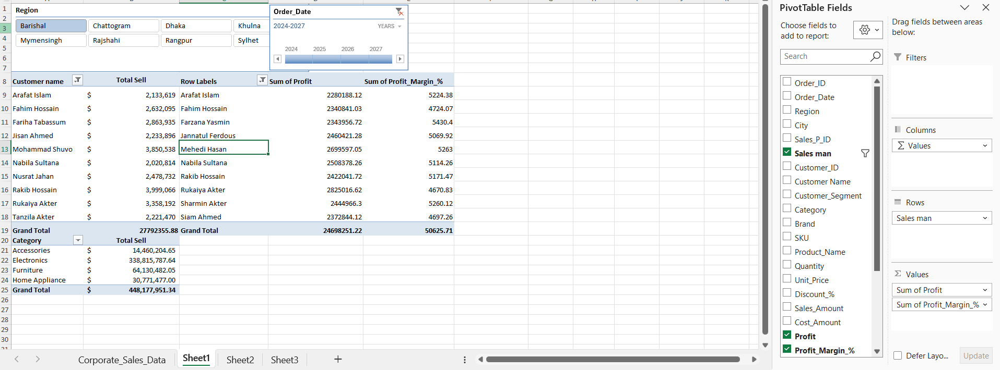
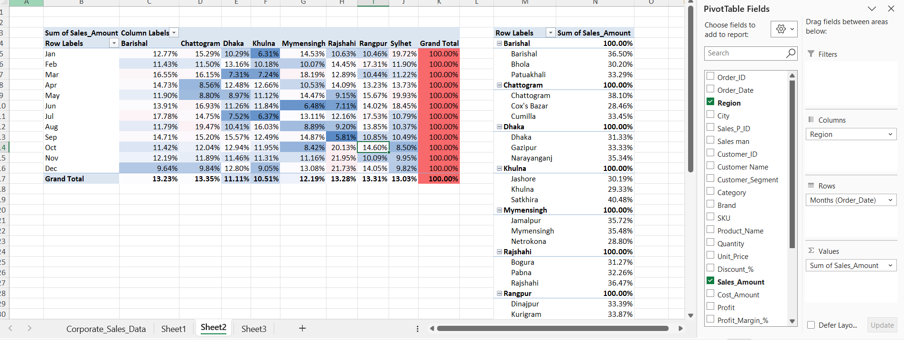

---

## What This Portfolio Demonstrates

- Data cleaning and preparation
- Power Query transformations
- Excel formulas and structured calculations
- Lookup and reference functions
- Conditional and logical analysis
- Date and time calculations
- Flash Fill and text transformation
- Conditional formatting
- Table-based analysis
- Sales and business data analysis

---

## Tools & Features

- Microsoft Excel
- Excel Tables
- Structured References
- Formulas and Functions
- Flash Fill
- Conditional Formatting
- Data Validation
- Pivot Tables
- XLOOKUP
- VLOOKUP
- INDEX & MATCH
- SUMIFS, COUNTIFS and AVERAGEIFS
- IF, IFS, AND and OR
- Date & Time Functions
- Power Query

---

## Excel Workflow

```text
Raw Data
   ↓
Data Cleaning
   ↓
Formula-Based Analysis
   ↓
Lookup & Data Retrieval
   ↓
Conditional Analysis
   ↓
Business Calculations
   ↓
Structured Reporting
```

---

# 1. Excel Fundamentals

The fundamentals workbook covers core Excel operations used as the foundation for later analysis.

### Demonstrated

- Cell references
- Relative, absolute and mixed references
- Paste Special
- Basic formulas
- SUM
- AVERAGE
- MAX
- MIN
- SUMPRODUCT
- SUBTOTAL
- Basic sales calculations

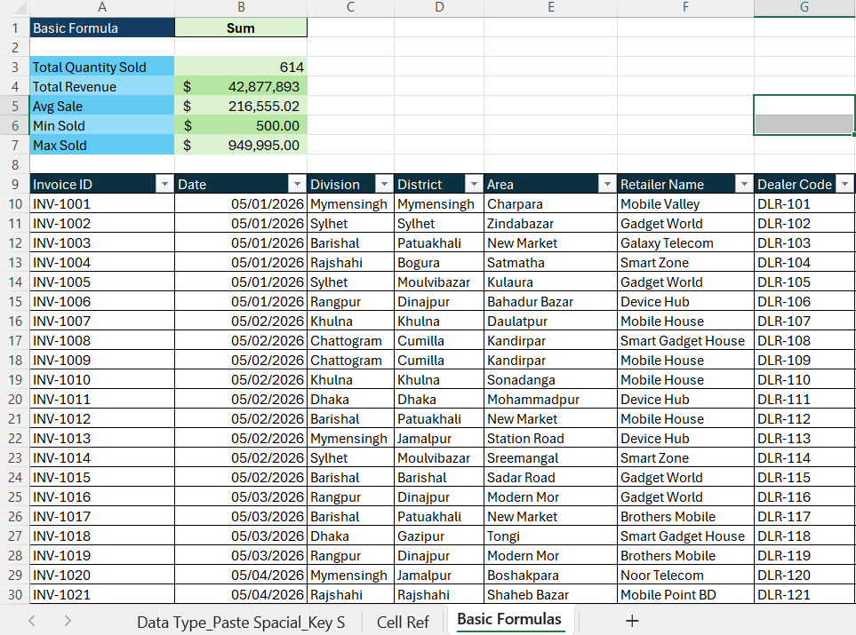

[Open Workbook](Workbooks/C-1.xlsx)

---

# 2. Data Cleaning & Preparation

Practical examples of preparing inconsistent data for analysis.

### Demonstrated

- Handling formula errors with `IFERROR`
- Number and date formatting
- Name extraction
- Removing blank cells
- Filling missing values
- Removing duplicate records
- Standardizing text
- Using `TRIM` and `PROPER`
- Find and Replace
- Restructuring unstacked data

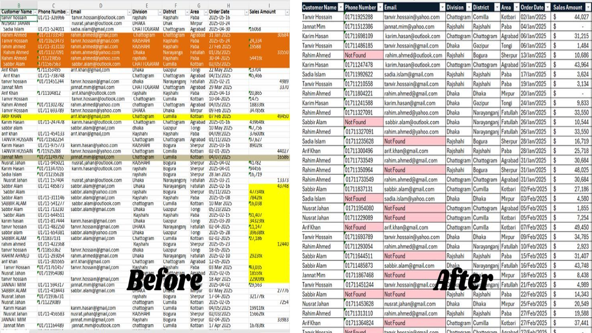

[Open Workbook](Workbooks/C-2%20Data%20Cleaning.xlsx)

---

# 3. Flash Fill & Text Transformation

Flash Fill was practiced for fast, repeatable text transformations.

### Demonstrated

- Changing text case
- Creating full names
- Separating names
- Reordering names
- Creating sentences
- Generating email IDs
- Formatting dates
- Adding country codes to phone numbers

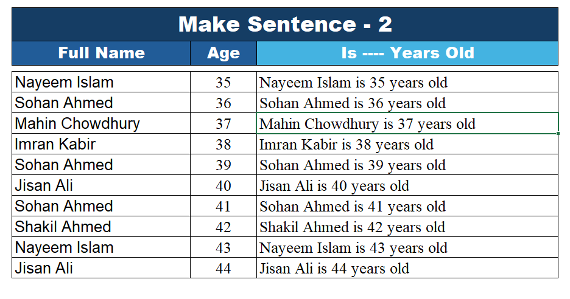

[Open Workbook](Workbooks/C-2%20Flash%20Fill.xlsx)

---

# 4. Conditional Formatting

Conditional formatting was used to make important values and exceptions easier to identify.

### Demonstrated

- Rule-based highlighting
- Pass and Fail indicators
- Threshold-based formatting
- Highlighting values above or below limits
- Condition-based row formatting

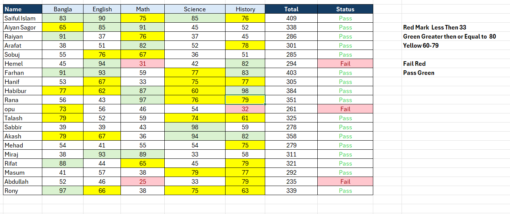

[Open Workbook](Workbooks/C-4%20Conditional%20Formatting.xlsx)

---

# 5. Conditional & Criteria-Based Analysis

Excel criteria functions were practiced through business-oriented scenarios.

### Demonstrated

- `SUMIF`
- `SUMIFS`
- `COUNTIF`
- `COUNTIFS`
- `AVERAGEIF`
- `AVERAGEIFS`
- `MAXIFS`
- `MINIFS`
- Multiple criteria
- Date-based criteria
- Wildcard criteria
- Structured references

### Example Use Cases

- Regional sales analysis
- Product analysis
- Threshold-based sales analysis
- Date-range analysis
- Target-based calculations

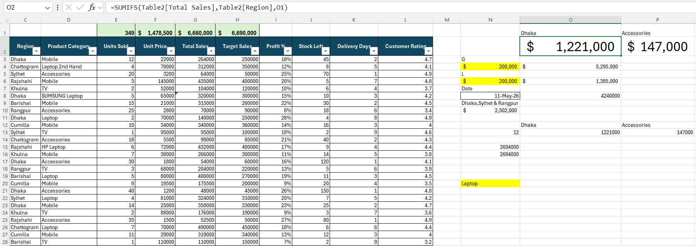

[Open Workbook](Workbooks/C-5%20Conditional%20Functions.xlsx)

---

# 6. Date & Time Functions

Date and time functions were applied to practical business scenarios.

### Use Cases

- HR attendance
- Employee age
- Service length
- Invoice aging
- Payment status
- Probation planning
- Delivery SLA
- Day-of-week analysis

### Functions Practiced

- `TODAY`
- `DATEDIF`
- Date arithmetic
- `MAX`
- `INT`
- `MOD`
- Date-based conditional logic

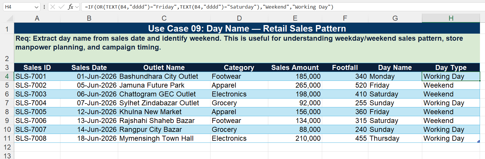

[Open Workbook](Workbooks/C-5%20Excel_Date_Time_Functions_Real_Usecase.xlsx)

---

# 7. IF & Logical Functions

Logical functions were practiced through classification, eligibility and rule-based decision scenarios.

### Demonstrated

- `IF`
- Nested `IF`
- `IFS`
- `AND`
- `OR`
- Multi-condition logic
- Age-group classification
- Pass/Fail classification
- Eligibility rules
- Threshold-based calculations

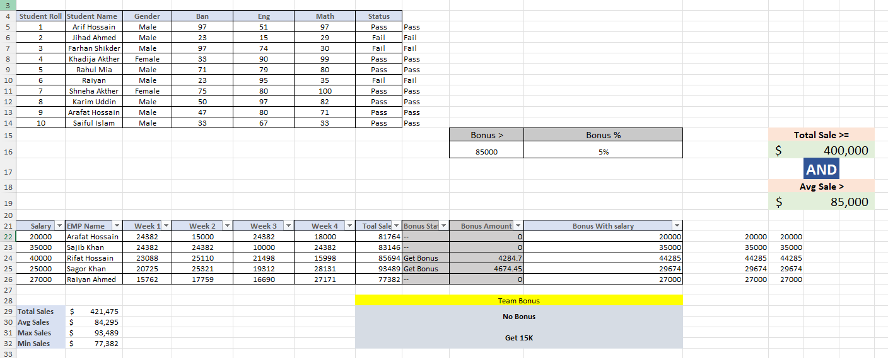

[Open Workbook](Workbooks/C-5%20IF%2C%20Nested%20IFS.xlsx)

---

# 8. Advanced VLOOKUP

VLOOKUP was extended beyond basic exact-match retrieval.

### Demonstrated

- Exact and approximate lookup
- `IFERROR` with VLOOKUP
- Dynamic column retrieval
- `COLUMNS` with VLOOKUP
- Dynamic lookup selection
- Multiple-condition lookup logic
- VLOOKUP with MATCH
- Multi-column retrieval

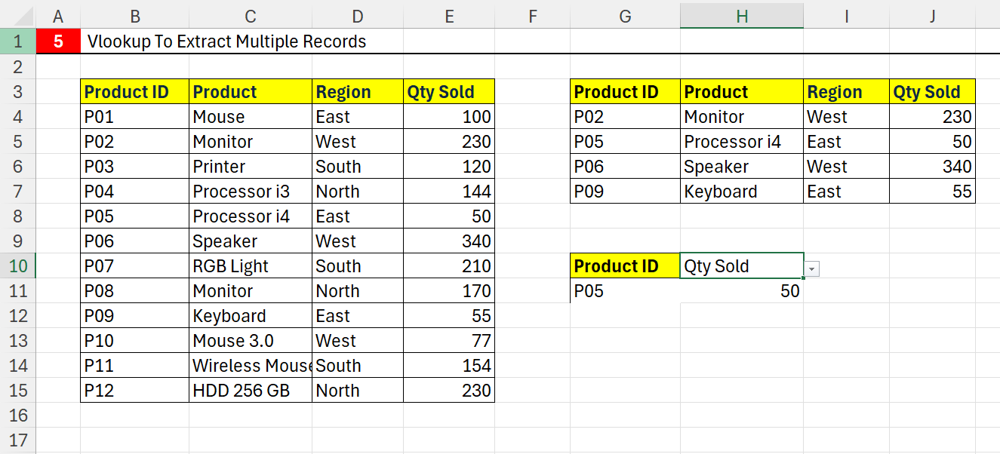

[Open Workbook](Workbooks/C-6%20Advanced%20lookup%20formulas.xlsx)

---

# 9. INDEX & MATCH

INDEX and MATCH were practiced as flexible lookup and retrieval methods.

### Demonstrated

- `INDEX`
- `MATCH`
- INDEX + MATCH
- Row-based lookup
- Column-based lookup
- Two-dimensional lookup

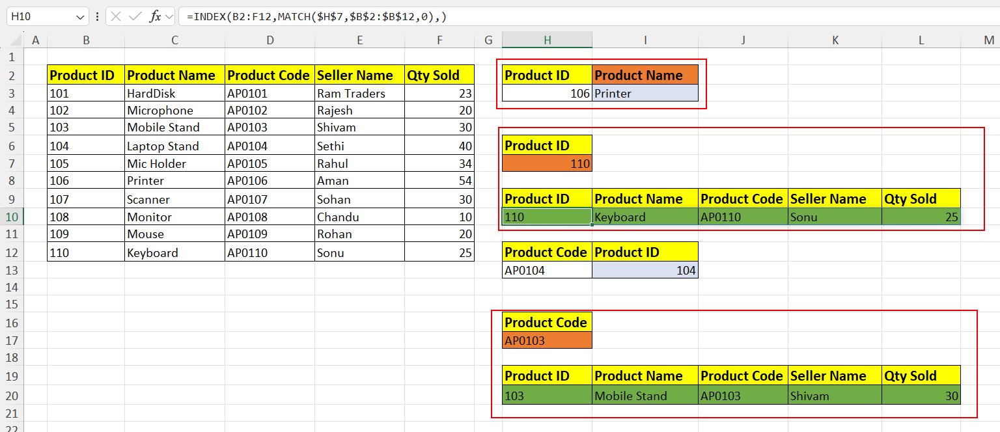

[Open Workbook](Workbooks/C-6%20Index-Match.xlsx)

---

# 10. XLOOKUP

XLOOKUP was practiced across standard and more advanced retrieval scenarios.

### Demonstrated

- Basic XLOOKUP
- Returning complete records
- Multiple-column retrieval
- `CHOOSE`
- `CHOOSECOLS`
- Multiple lookup values
- Two-way XLOOKUP
- Nested XLOOKUP
- Wildcard lookup
- Lookup across multiple tables
- Excel Table references

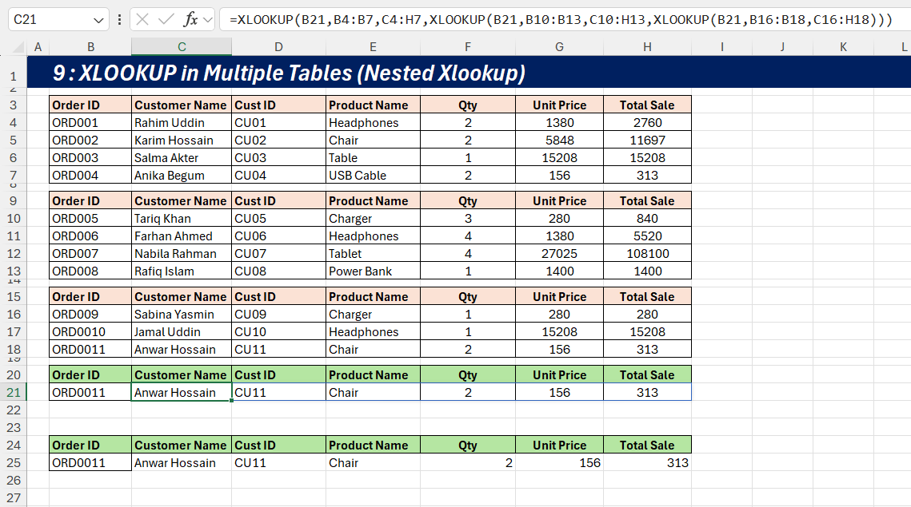

[Open Workbook](Workbooks/C-6%20Xlookup%20formulas.xlsx)

---

# 11. Corporate Bangladesh Sales Analysis

A larger Bangladesh sales dataset was used for practical business analysis.

### Analysis Areas

- Customer-level sales
- Sales by region and city
- Monthly sales
- Product and category analysis
- Sales employee analysis
- Quantity analysis
- Profit analysis
- Profit margin analysis
- Pivot-based summaries
- Supporting customer and sales-employee tables


[Open Workbook](Workbooks/C-7%20Corporate_Bangladesh_Sales_Dataset.xlsx)

---

# 12. Power Query

A separate case study focused on using Power Query for practical data cleaning and transformation.

### Demonstrated

- Importing and preparing source data
- Promoting headers
- Removing unnecessary rows
- Removing duplicate records
- Handling null and missing values
- Replacing missing values
- Splitting columns
- Extracting information from text
- Creating an index for unique IDs
- Standardizing inconsistent data
- Transforming raw transaction data
- Preparing structured, analysis-ready tables

### Case Studies

**Employee Data Cleaning**

- Cleaned inconsistent employee records
- Standardized names and fields
- Handled missing values
- Removed duplicate records
- Created structured employee IDs

**E-commerce Transaction Cleaning**

- Cleaned raw transaction data
- Removed unnecessary information
- Transformed text-based fields
- Prepared the dataset for analysis

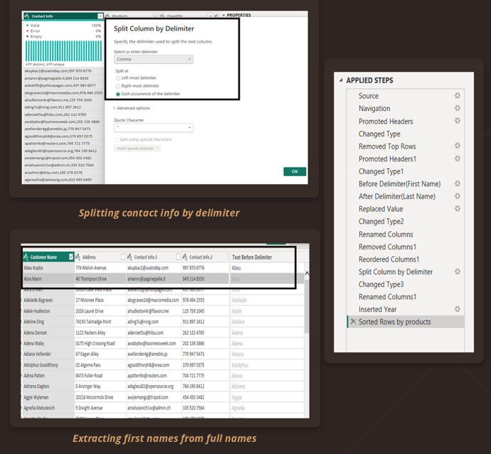

[View Power Query Case Study](Workbooks/FromChaosToClarity(1).pptx)

---

# Skills at a Glance

| Area | Skills |
|---|---|
| Data Preparation | Cleaning, formatting, duplicates, missing values, text transformation |
| Excel Fundamentals | Cell references, Paste Special, basic calculations |
| Power Query | Data transformation, cleaning, null handling, duplicate removal, column splitting |
| Text Handling | Flash Fill, TRIM, PROPER, UPPER, LOWER, text restructuring |
| Conditional Analysis | IF, IFS, AND, OR |
| Criteria-Based Analysis | SUMIFS, COUNTIFS, AVERAGEIFS, MAXIFS, MINIFS |
| Lookups | VLOOKUP, XLOOKUP, INDEX, MATCH |
| Advanced Retrieval | Multi-condition, two-way, wildcard and multi-table lookups |
| Date & Time | TODAY, DATEDIF, date arithmetic, aging and SLA calculations |
| Data Presentation | Conditional formatting, tables, structured references |
| Business Analysis | Sales, customers, products, employees and profitability |

---

# Notes

- This repository focuses on **Excel skills and practical analysis**, not dashboard visualization.
- The workbooks contain practice exercises and business-oriented examples developed across different datasets.
- Dashboard-focused work is documented separately.

---

# Author

**Dipan Nandi**

Statistics Graduate | Data Analytics

- LinkedIn: YOUR_LINKEDIN_URL
- GitHub: YOUR_GITHUB_URL
