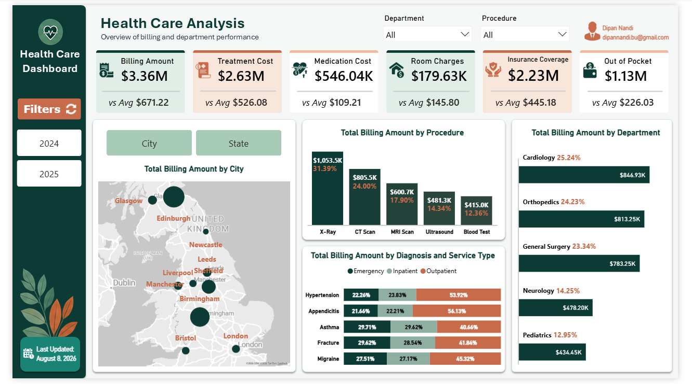
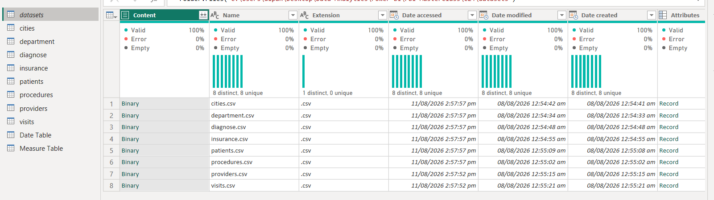
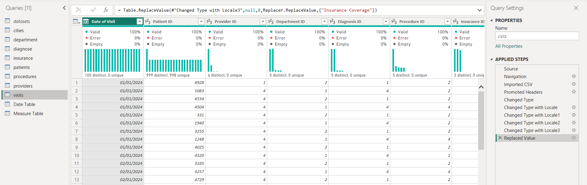
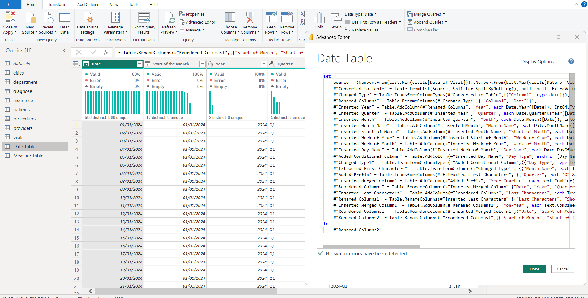
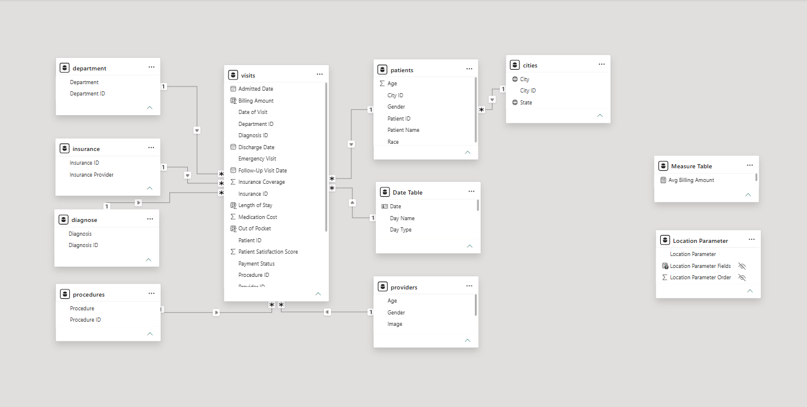
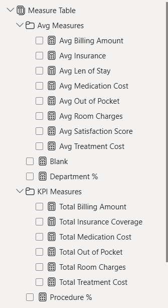

# Healthcare Analysis using Power BI

A Power BI project that turns healthcare visit data into a practical view of **billing, treatment costs, insurance coverage, department performance, procedures, diagnoses, and patient activity**.

The project covers the full reporting workflow from source files and Power Query preparation to data modeling, DAX measures, interactive filtering, and dashboard design.

---

## Dashboard Preview

<!-- IMAGE PLACEHOLDER: Replace `images/dashboard-preview.png` if you later capture a higher-resolution final dashboard image. -->



### Live Dashboard

[View the published Power BI dashboard](https://app.powerbi.com/view?r=eyJrIjoiZjFmN2FmYTMtNTBiMi00NmI3LTg2NDUtMzVhMjU1Y2ZjNDI0IiwidCI6IjNjZDA3OTg4LTUyNjMtNDA2NC1hZDU1LWU5NTZhYjNkZDExNyIsImMiOjEwfQ%3D%3D)

---

## Project Overview

This project demonstrates how raw healthcare data can be transformed into a clean analytical model and then presented as an interactive business report.

### Main goals

- Prepare multiple healthcare source tables for analysis
- Build relationships between visits, patients, providers, and lookup tables
- Create reusable DAX measures for financial and operational KPIs
- Build a date table for time-based analysis
- Use field parameters for flexible geographic analysis
- Present the results in a recruiter-friendly Power BI dashboard

---

## Business Questions

The report is designed to help answer questions such as:

- How much is being billed across the healthcare operation?
- How are treatment, medication, room, and insurance amounts distributed?
- Which departments generate the highest billing?
- Which procedures contribute most to billing?
- How does billing vary by city and state?
- What is the relationship between diagnosis and service type?
- How do satisfaction and operational measures compare across the data?

---

## Tools & Technologies

- **Microsoft Power BI Desktop**
- **Power Query**
- **DAX**
- **Data Modeling**
- **Excel/CSV source data**

---

## Project Workflow

```text
Source CSV Files
      ↓
Power Query
      ↓
Data Cleaning & Transformation
      ↓
Data Model & Relationships
      ↓
Date Table + Parameters
      ↓
DAX Measures
      ↓
Interactive Dashboard
      ↓
Published Power BI Report
```

---

## Dataset

The project uses eight CSV source files.

| Source | Purpose | Records |
|---|---|---:|
| `visits.csv` | Visit-level financial and operational data | 5,000 |
| `patients.csv` | Patient details | 4,973 |
| `providers.csv` | Provider information | 5 |
| `cities.csv` | City and state lookup | 40 |
| `department.csv` | Department lookup | 5 |
| `diagnose.csv` | Diagnosis lookup | 5 |
| `procedures.csv` | Procedure lookup | 5 |
| `insurance.csv` | Insurance provider lookup | 3 |

The visit data covers **January 1, 2024 to May 14, 2025**.

---

# Data Preparation with Power Query

Power Query was used as the preparation layer before the data entered the analytical model.

### Key work performed

- Imported multiple CSV files through a source folder structure
- Promoted headers and standardized column names
- Applied appropriate data types
- Used locale-aware date transformations
- Replaced null and invalid values where required
- Prepared the visit table for analysis
- Built a dedicated date table from the visit date range
- Added date attributes such as year, quarter, month, week, and day-related fields
- Organized source and lookup tables for the model

### Source Folder Ingestion

<!-- IMAGE PLACEHOLDER: `images/power-query-source-folder.png` -->



### Visit Data Transformation

<!-- IMAGE PLACEHOLDER: `images/power-query-visits.png` -->



### Dynamic Date Table

A dedicated date table was created in Power Query using the minimum and maximum visit dates from the source data. The table was then enriched with fields for time-based reporting.

<!-- IMAGE PLACEHOLDER: `images/date-table-power-query.png` -->



---

# Data Modeling

The model uses `visits` as the central transactional table and connects it with supporting lookup and dimension tables.

### Model components

- `visits`
- `patients`
- `providers`
- `cities`
- `department`
- `diagnose`
- `procedures`
- `insurance`
- `Date Table`
- `Measure Table`
- `Location Parameter`

### Modeling focus

- Primary key and foreign key relationships
- One-to-many relationships between lookup tables and visit records
- Dedicated date table for time analysis
- Separate measure table for organized DAX calculations
- Field parameter for switching geographic analysis

<!-- IMAGE PLACEHOLDER: `images/data-model.png` -->



---

# DAX Development

DAX was used to create reusable measures instead of relying only on visual-level calculations.

### KPI Measures

- Total Billing Amount
- Total Insurance Coverage
- Total Medication Cost
- Total Out of Pocket
- Total Room Charges
- Total Treatment Cost

### Average Measures

- Average Billing Amount
- Average Insurance
- Average Length of Stay
- Average Medication Cost
- Average Out of Pocket
- Average Room Charges
- Average Satisfaction Score
- Average Treatment Cost

### Additional calculations

- Department %
- Procedure %
- Supporting KPI calculations for dashboard cards

<!-- IMAGE PLACEHOLDER: `images/dax-measures.png` -->



---

# Dashboard

## Healthcare Analysis

The dashboard provides a compact view of healthcare financial and operational performance.

### KPI Cards

- Billing Amount
- Treatment Cost
- Medication Cost
- Room Charges
- Insurance Coverage
- Out of Pocket

### Interactive Filters

- Department
- Procedure
- Year

### Visual Analysis

- Total Billing Amount by City
- Total Billing Amount by Procedure
- Total Billing Amount by Department
- Billing Amount by Diagnosis and Service Type
- City and State analysis through a field parameter


<!-- IMAGE PLACEHOLDER: Replace `images/dashboard-preview.png` if you later capture a higher-resolution final dashboard image. -->


---

# Key Takeaways

Based on the dashboard and source data:

- Total billing is approximately **$3.36M**.
- Treatment cost contributes approximately **$2.63M**.
- Medication cost contributes approximately **$546K**.
- Insurance coverage is approximately **$2.23M**.
- Room charges contribute approximately **$179.63K**.
- The dashboard highlights **Cardiology** as the leading department by billing.
- **X-Ray** is the highest-billing procedure in the report.
- Billing varies noticeably across departments, procedures, diagnoses, service types, and locations.
- The City/State parameter allows the geographic view to be changed without rebuilding the visual.

---

# Skills Demonstrated

### Power Query

- Folder-based data ingestion
- CSV transformation
- Data type management
- Locale-aware transformations
- Null and error handling
- Date transformation
- Custom date table creation
- Query organization

### Data Modeling

- Fact and dimension concepts
- Relationships
- Lookup tables
- Date table
- Measure table
- Field parameters
- Model organization

### DAX

- KPI measures
- Aggregation measures
- Average measures
- Percentage calculations
- Reusable measure design

### Power BI

- Dashboard design
- KPI cards
- Slicers
- Map visualization
- Comparison charts
- Dynamic geographic analysis
- Interactive reporting

### Business Analysis

- Healthcare billing analysis
- Department performance
- Procedure analysis
- Diagnosis analysis
- Insurance coverage analysis
- Patient and service analysis
- Geographic analysis

---

# Connect With Me

**Dipan Nandi**

- LinkedIn: [linkedin.com/in/dipannandi](https://www.linkedin.com/in/dipannandi/)
- Email: dipannandi.bu@gmail.com
