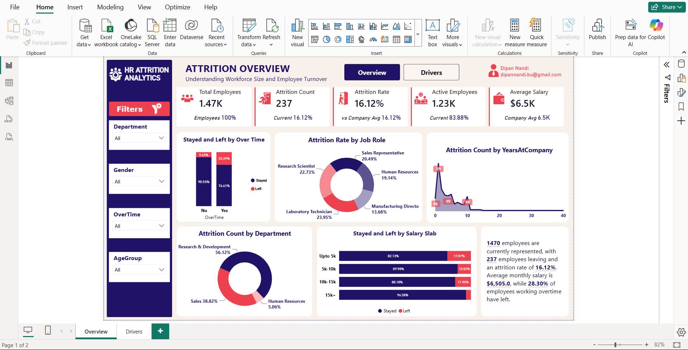
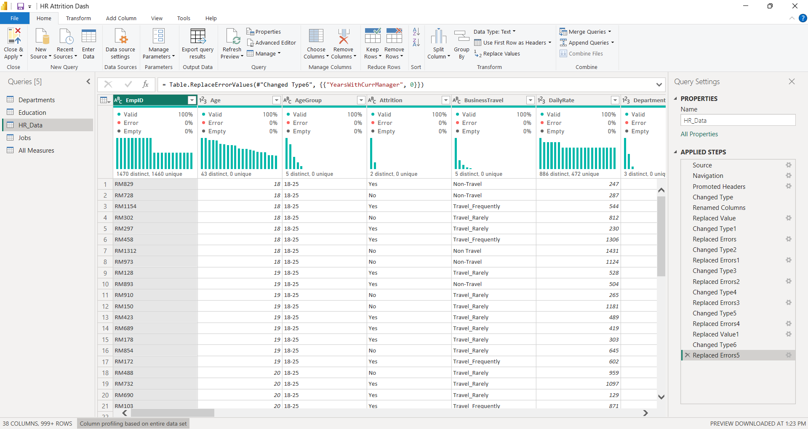
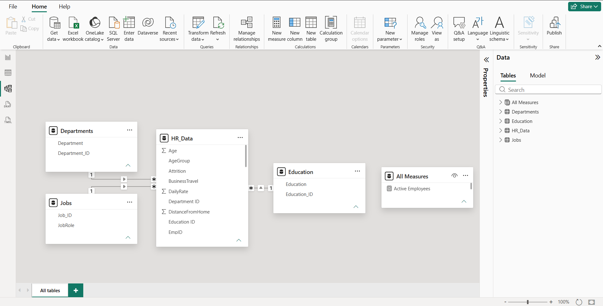
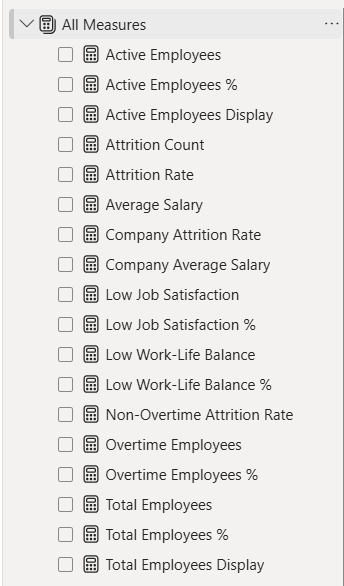
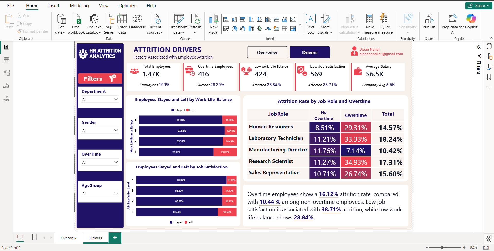

# HR Attrition Analysis using Power BI

A Power BI workforce analytics project focused on understanding employee attrition, workforce composition, and factors associated with employee turnover.

**Built with:** Power BI Desktop, Power Query, DAX, Data Modeling

[**View the Live Report**](https://app.powerbi.com/view?r=eyJrIjoiMmU5ZWVkZTQtOWQyYy00M2NlLWFmMjgtMWQzYTQ4NGNkMTliIiwidCI6IjNjZDA3OTg4LTUyNjMtNDA2NC1hZDU1LWU5NTZhYjNkZDExNyIsImMiOjEwfQ%3D%3D)

---

## Dashboard Preview



---

## Project Snapshot

| Area | Details |
|---|---|
| **Business area** | Human Resources |
| **Focus** | Employee attrition and workforce analysis |
| **Data source** | Excel workbook |
| **Data preparation** | Power Query |
| **Data modeling** | Relationships between fact-style HR data and lookup tables |
| **Calculations** | DAX measures and KPI logic |
| **Reporting** | Interactive Power BI report |
| **Report pages** | Overview and Drivers |

---

## Business Problem

Employee turnover can affect workforce stability, hiring needs, and operational continuity.

This report was designed to help explore:

- How many employees are currently represented
- How many employees have left
- Overall attrition rate
- Attrition across departments and job roles
- The relationship between attrition and overtime
- Work-life balance and job satisfaction patterns
- Attrition across salary bands and tenure

---

## Project Workflow

```text
Excel Data
    ↓
Power Query
    ↓
Data Preparation
    ↓
Data Model
    ↓
DAX Measures
    ↓
Interactive Report
    ↓
HR Insights
```

---

## Dataset

The supplied Excel workbook contains four sheets:

- **HR_Data**
- **Education**
- **Jobs**
- **Departments**

The project uses the Excel workbook as the source for the Power BI model.

---

## Power Query

Power Query was used to prepare the source data before analysis.

### Key work shown

- Loaded the HR workbook into Power BI
- Promoted headers
- Changed data types
- Renamed columns
- Replaced errors
- Replaced values
- Prepared the HR data and supporting lookup tables for modeling

### Transformation Evidence



---

## Data Modeling

The report uses a relational model connecting the main HR data with supporting lookup tables.

### Model Components

- HR employee data
- Department lookup
- Education lookup
- Job role lookup
- Dedicated measures table

### Modeling Focus

- One-to-many relationships
- Lookup relationships through ID fields
- Centralized DAX measures
- Structured model for report-level analysis



---

## DAX Development

A dedicated **All Measures** table was used to organize the report's calculations.

### Measures shown in the project

- Total Employees
- Total Employees %
- Total Employees Display
- Active Employees
- Active Employees %
- Active Employees Display
- Attrition Count
- Attrition Rate
- Average Salary
- Company Attrition Rate
- Company Average Salary
- Low Job Satisfaction
- Low Job Satisfaction %
- Low Work-Life Balance
- Low Work-Life Balance %
- Non-Overtime Attrition Rate
- Overtime Employees
- Overtime Employees %
- Overtime Employees Display

These measures support the KPI cards, charts, comparison views, and narrative summaries used throughout the report.



---

## Dashboard Pages

### 1. Attrition Overview

The Overview page provides a high-level view of workforce size and employee turnover.

### Highlights

- Total Employees
- Attrition Count
- Attrition Rate
- Active Employees
- Average Salary
- Stayed vs Left by Overtime
- Attrition Rate by Job Role
- Attrition Count by Years at Company
- Attrition Count by Department
- Stayed vs Left by Salary Slab
- Interactive Department, Gender, Overtime, and Age Group filters
- Dynamic business summary


---

### 2. Attrition Drivers

The Drivers page focuses on factors associated with employee attrition.

### Highlights

- Overtime employee analysis
- Work-life balance analysis
- Job satisfaction analysis
- Attrition by job role and overtime
- KPI comparison against company averages
- Interactive Department, Gender, Overtime, and Age Group filters
- Narrative summary of key findings



---

## Key Findings

The dashboard surfaces several notable patterns from the analysis:

- The report represents **1.47K employees**.
- **237 employees** are shown as having left.
- Overall attrition is shown at **16.12%**.
- Employees working overtime show higher attrition than non-overtime employees in the report.
- Low job satisfaction is associated with a higher observed attrition rate.
- Low work-life balance also shows a higher observed attrition rate.
- Attrition varies considerably across job roles and departments.
- Salary bands provide another useful perspective for comparing employees who stayed and left.

> These findings describe patterns visible in the report. They should be interpreted as associations in the dataset, not proof of causation.

---

## Skills Demonstrated

### Power BI

- Interactive report development
- KPI design
- Slicer-based filtering
- Dashboard navigation
- Business-focused visual design
- Narrative reporting

### Power Query

- Data import
- Data type transformation
- Header promotion
- Column renaming
- Error replacement
- Value replacement
- Query preparation

### Data Modeling

- Relationship design
- Lookup tables
- ID-based relationships
- Dedicated measures table
- Structured analytical model

### DAX

- KPI measures
- Percentage calculations
- Attrition calculations
- Employee metrics
- Comparison metrics
- Display measures
- Conditional business logic

### HR Analytics

- Attrition analysis
- Workforce analysis
- Overtime analysis
- Job satisfaction analysis
- Work-life balance analysis
- Salary band analysis
- Department and job role analysis


---

## Connect

**Dipan Nandi**

- LinkedIn: https://www.linkedin.com/in/dipannandi/
- Email: dipannandi.bu@gmail.com
