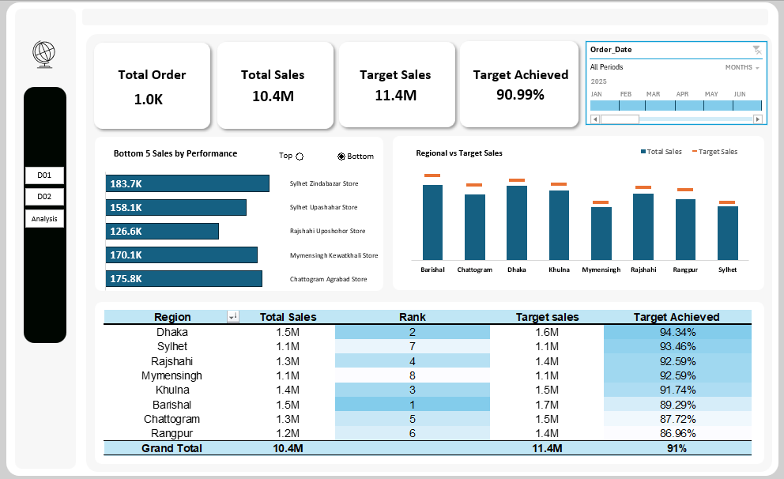
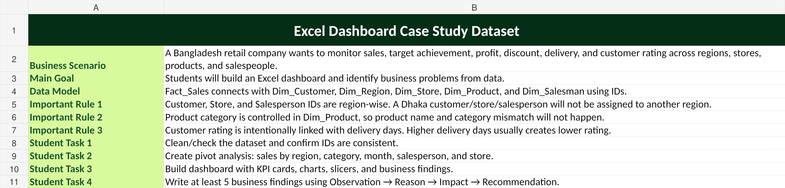
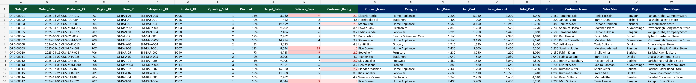
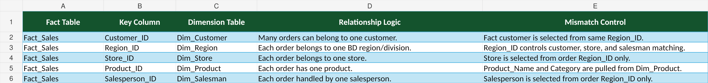
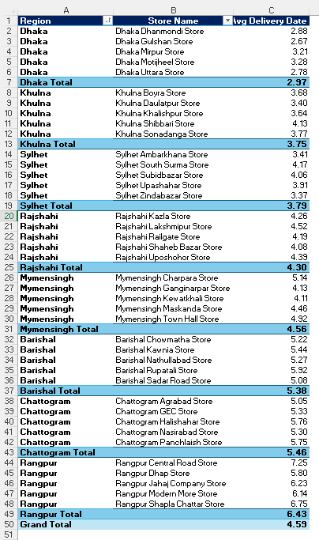
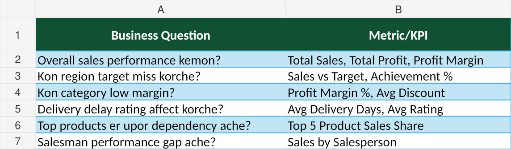
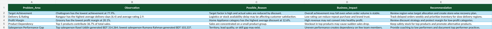
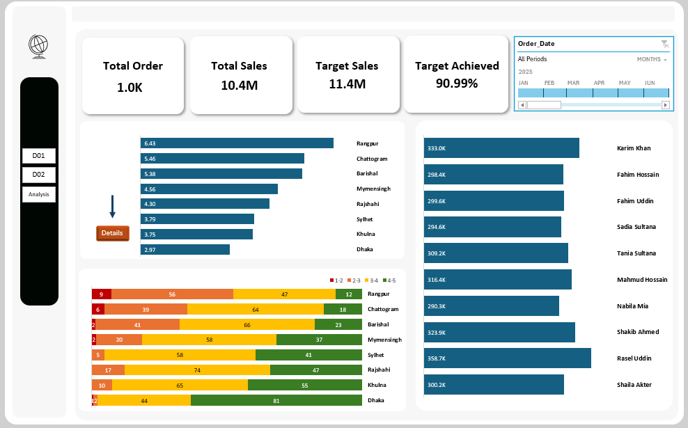

# Retail Sales Analytics Case Study using Excel

An end-to-end **Microsoft Excel retail analytics case study** that transforms structured sales data into a business-focused reporting solution covering **sales performance, target achievement, profit, discount, delivery, customer rating, product concentration, regional performance, store performance, and salesperson performance**.

The workbook is designed around a Bangladesh retail business scenario and follows a practical analytics workflow from **structured source data and validation to data modeling, formula-based calculations, analysis, dashboard planning, and business recommendations**.

---

# Dashboard Overview

## Dashboard Preview



The dashboard brings the retail operation into a management-focused view instead of requiring decision-makers to work through transaction-level rows.

[Open Workbook](workbook/Excel_Dashboard_Case_Study.xlsx)

It is designed to move through the business story in a clear sequence:

```text
Overall Business Performance
        ↓
Regional Sales vs Target
        ↓
Customer Rating & Delivery Performance
        ↓
Salesperson Performance
        ↓
Store-Level Drill Down
        ↓
Business Recommendations
```

The dashboard focuses on **overall sales and target achievement**, **regional performance**, **delivery delays**, **customer ratings**, **salesperson contribution**, and **store-level operational performance**.

At the workbook level, the `Analysis` sheet reports **1,000 orders**, **BDT 10.37M in total sales**, **BDT 11.40M in target sales**, and **90.99% target achievement**. These metrics provide the starting point for investigating where performance gaps are concentrated and which operational areas require attention.

The central management question behind the dashboard is:

> **How is the retail business performing, where is the performance gap coming from, and what should management investigate next?**

---

## Project Snapshot

| Area | Details |
|---|---|
| **Business area** | Retail Sales & Operations |
| **Tool** | Microsoft Excel |
| **Data structure** | Fact table + dimension tables |
| **Main transaction table** | `Fact_Sales` |
| **Transaction records** | 1,000 orders |
| **Primary analysis areas** | Sales, Target, Profit, Delivery, Rating, Product, Region, Store, Salesperson |
| **Reporting components** | Analysis, Delivery Details, Dashboard Plan, Business Findings, Dashboard sheets |
| **Main objective** | Identify performance gaps and translate them into actionable business recommendations |

---

# Business Problem

A retail company needs a reliable way to monitor sales performance across regions, stores, products, and salespeople while also understanding operational indicators such as delivery time and customer rating.

The case study is designed to answer questions such as:

- How much sales has the business generated?
- How close is actual sales to the target?
- Which regions are missing their targets?
- Which categories are generating weaker margins?
- Is delivery performance connected with customer satisfaction?
- How dependent is the business on its top-selling products?
- Are there noticeable performance gaps between salespeople?
- Which operational areas require management attention?

The workbook also defines business rules for maintaining consistency between the fact table and the related dimension tables.

---

# Project Workflow

```text
Structured Excel Data
        ↓
Data Validation & Consistency Checks
        ↓
Fact & Dimension Data Model
        ↓
Calculated Fields & Excel Formulas
        ↓
KPI & Business Analysis
        ↓
Delivery & Operational Analysis
        ↓
Dashboard Planning
        ↓
Business Findings & Recommendations
```

This workflow keeps the project focused on the same principle throughout:

**Organize the data → calculate the right metrics → understand the pattern → identify the business problem → recommend an action.**

---

# Dataset

The workbook is organized into a central transactional table and supporting dimension tables.

| Sheet | Purpose |
|---|---|
| `Fact_Sales` | Main transaction-level sales data |
| `Dim_Region` | Region and regional manager reference data |
| `Dim_Customer` | Customer reference information |
| `Dim_Store` | Store and store-type information |
| `Dim_Product` | Product, category, brand, price and cost information |
| `Dim_Salesman` | Salesperson and assigned-store information |
| `Analysis` | KPI and performance analysis |
| `Delivery Details` | Store-level average delivery analysis |
| `Data_Model` | Relationship and consistency logic |
| `Dashboard_Plan` | Business questions and required KPIs |
| `Business_Findings` | Observations, possible reasons, impact and recommendations |
| `Sample_Dashboard` | Sample dashboard layout and KPI formulas |
| `Dash 01` | Dashboard worksheet |
| `Dash02` | Dashboard worksheet |
| `Case_Study` | Business scenario, rules and task definitions |

The core `Fact_Sales` table contains **1,000 orders** and links transactions to customer, region, store, salesperson, and product information through IDs.

---

# Data Preparation & Validation

The case study begins with consistency checks rather than immediately building visuals.

The `Case_Study` and `Data_Model` sheets define rules such as:

- Customer, store, and salesperson IDs are region-specific.
- Customers, stores, and salespeople are selected from the same region as the transaction.
- Product name and category are controlled through `Dim_Product`.
- The fact table connects to the dimension tables through ID-based relationships.
- Delivery days and customer rating are intentionally related in the case-study logic.

### Validation Focus

The project demonstrates practical spreadsheet thinking around:

- Checking ID consistency
- Maintaining controlled dimension values
- Preventing region mismatch
- Separating transaction data from descriptive reference data
- Building a repeatable analytical structure before reporting

### Evidence



The `Case_Study` sheet establishes the scenario, rules, and analytical objectives before the calculations and reporting layers.

---

# Data Modeling

The workbook uses a relational structure where `Fact_Sales` acts as the central transaction table and connects to supporting dimension tables.

### Model Components

- `Fact_Sales`
- `Dim_Customer`
- `Dim_Region`
- `Dim_Store`
- `Dim_Product`
- `Dim_Salesman`

### Modeling Focus

- ID-based relationships
- Fact and dimension separation
- Region-controlled customer, store and salesperson assignment
- Product lookup through `Product_ID`
- Store and salesperson assignment through region-specific IDs



The `Fact_Sales` sheet is the transactional foundation of the project.



The `Data_Model` sheet documents how the fact table connects to each dimension and how mismatch conditions are controlled.

---

# Excel Analysis & KPI Development

The workbook combines lookup-style enrichment, arithmetic calculations, summary formulas, and analysis tables to create business-ready metrics.

## Core Business Metrics

The `Analysis` sheet contains KPI calculations for:

- Total Orders
- Total Sales
- Target Sales
- Target Achievement %

The current workbook analysis shows:

- **1,000 Total Orders**
- **BDT 10.37M Total Sales**
- **BDT 11.40M Target Sales**
- **90.99% Target Achievement**

Additional analysis sections cover regional performance, delivery performance, salesperson performance, store comparisons, customer rating, and product-related measures.

---

# Delivery & Operational Analysis

The `Delivery Details` sheet provides a store-level view of average delivery performance grouped by region and store.

This makes it possible to move from a broad regional issue to a more operational question:

**Which specific stores are contributing to slower delivery performance?**

The supplied project materials use this analysis to investigate the relationship between delivery delays and customer satisfaction, with Rangpur highlighted as a key operational area.



The screenshot shows the store-level average delivery structure used for the operational analysis.

---

# Dashboard Planning

Before building a dashboard, the workbook defines the business question first and then maps each question to an appropriate metric.

The `Dashboard_Plan` sheet contains questions around:

- Overall sales performance
- Regions missing targets
- Low-margin categories
- Delivery and rating relationships
- Top-product dependency
- Salesperson performance gaps

This creates a clear link between the **business problem** and the **metric required to investigate it**.



---

# Business Findings

The `Business_Findings` sheet uses a structured framework:

**Observation → Possible Reason → Business Impact → Recommendation**

The documented problem areas include:

### Target Achievement
The workbook highlights regional target performance as a management concern and recommends reviewing region-wise target allocation and recovery planning.

### Delivery & Rating
Rangpur is highlighted for high average delivery time and lower customer rating, with a recommendation to monitor delayed orders and prioritize inventory and logistics.

### Profit Margin
The findings identify a low-margin category and connect discount strategy with profitability concerns.

### Product Dependency
The workbook notes that the top 5 products contribute a meaningful share of total sales and recommends maintaining safety stock while promoting alternatives.

### Salesperson Performance Gap
The workbook compares top and lower-performing salespeople and recommends coaching and sharing effective practices.



The sheet is structured so that the analysis does not stop at describing a number. Each problem is followed by a possible explanation, business consequence, and suggested action.

---

# Dashboard Pages

The workbook contains dashboard worksheet areas as part of the larger case study.

The supplied presentation materials describe the dashboard story around:

- Overall business performance
- Regional sales versus target
- Delivery delays and customer ratings
- Salesperson performance
- Store-level operational drill-down
- Management recommendations




---

# Key Findings

Based on the workbook's analysis and the supplied case-study narrative:

- The analysis contains **1,000 orders**.
- Total sales are **BDT 10.37M**.
- Target sales are **BDT 11.40M**.
- Overall target achievement is **90.99%**.
- Regional target performance requires attention, with the workbook specifically documenting underperforming regions.
- Rangpur is highlighted for slower delivery performance and weaker customer ratings.
- Product concentration is significant enough to make top-product availability an operational consideration.
- Salesperson performance varies considerably across the network.
- The project connects operational metrics with financial and customer-facing outcomes instead of looking at sales alone.

> These findings describe patterns documented in the case study and workbook. They should be interpreted as analytical observations from the dataset, not proof of causation.

---

# Skills Demonstrated

## Microsoft Excel

- Advanced spreadsheet analysis
- Formula-based KPI development
- Structured workbook design
- Lookup-based data enrichment
- Conditional calculations
- Business-oriented spreadsheet modeling
- Data validation and consistency checking
- Performance comparison
- Operational analysis

## Data Modeling

- Fact table and dimension table structure
- ID-based relationships
- Relationship logic documentation
- Region-controlled reference data
- Structured analytical model

## Business Analysis

- KPI interpretation
- Target achievement analysis
- Regional performance analysis
- Profitability analysis
- Delivery performance analysis
- Customer rating analysis
- Product concentration analysis
- Salesperson performance comparison
- Store-level operational analysis
- Observation-to-recommendation storytelling

## Reporting & Dashboard Thinking

- KPI selection
- Business-question-driven reporting
- Dashboard planning
- Management-focused metric selection
- Interactive reporting concept
- Action-oriented insight design

[RetailAnalytics_PPTX](docs/RetailAnalytics_LinkedInDeck.pptx)


[Dashboard_Case_Study_PPTX](docs/Dashboard_Case_Study_Carousel.pptx)

---

# Connect With Me

**Dipan Nandi**

- LinkedIn: [linkedin.com/in/dipannandi](https://www.linkedin.com/in/dipannandi/)
- Email: dipannandi.bu@gmail.com